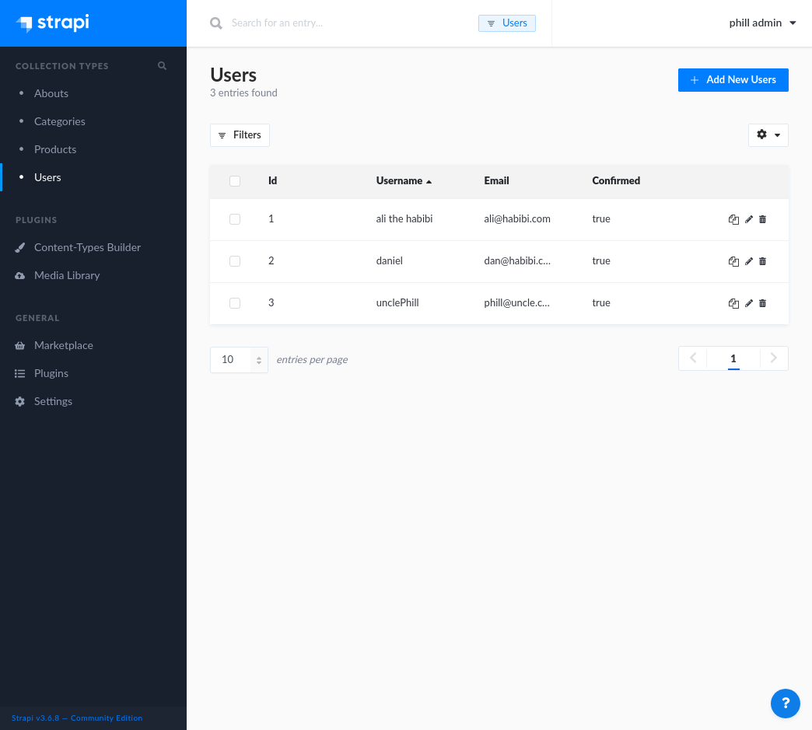
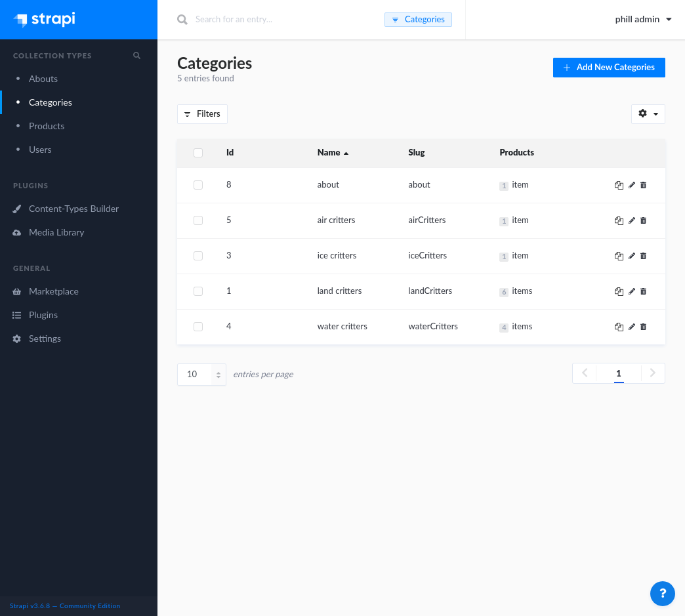
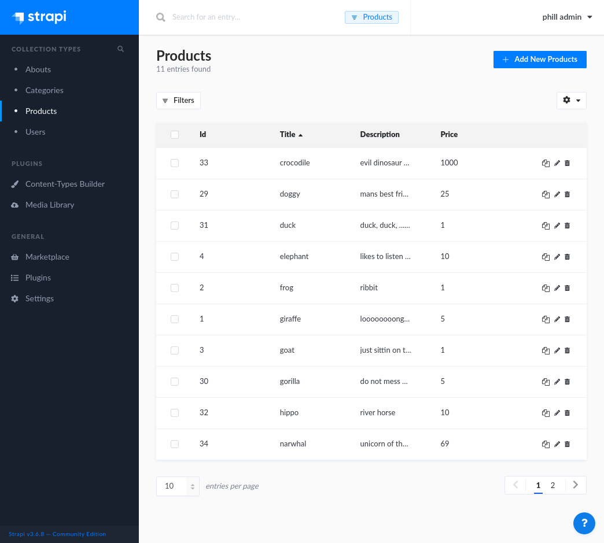
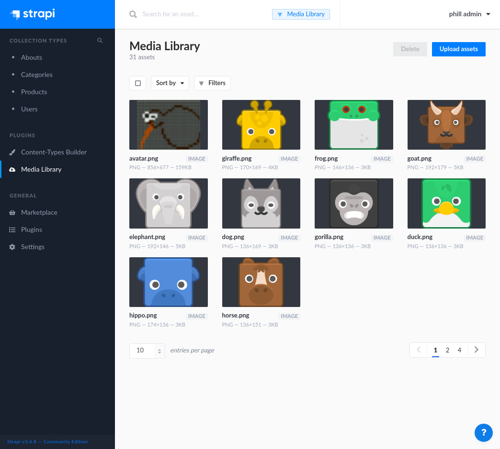
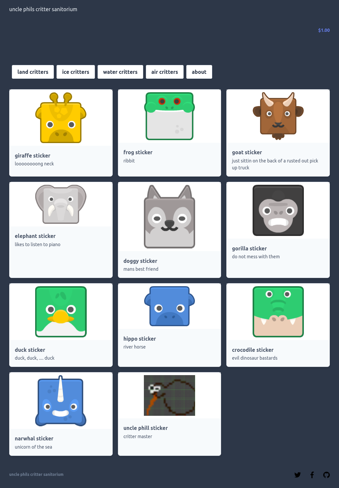
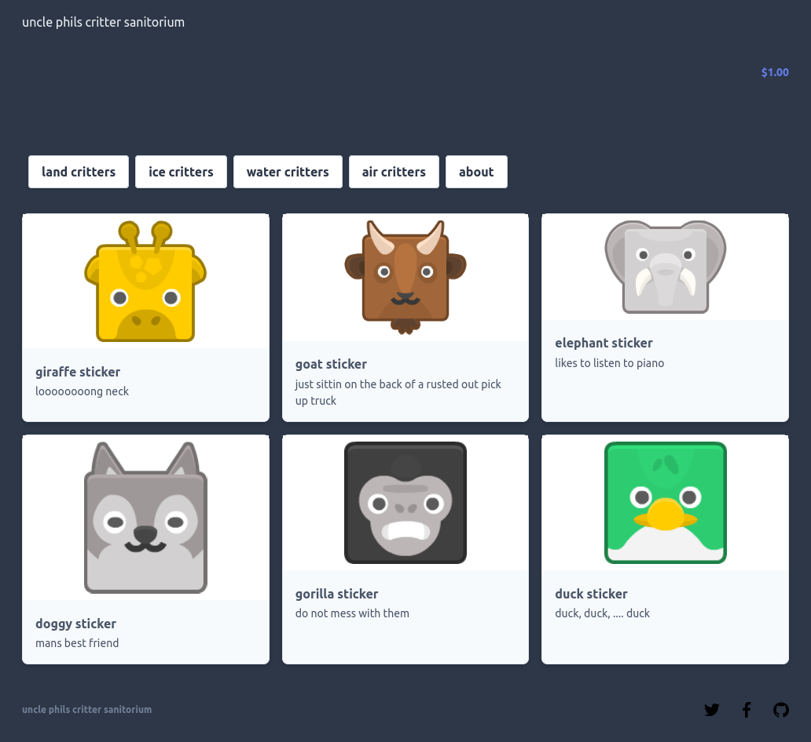
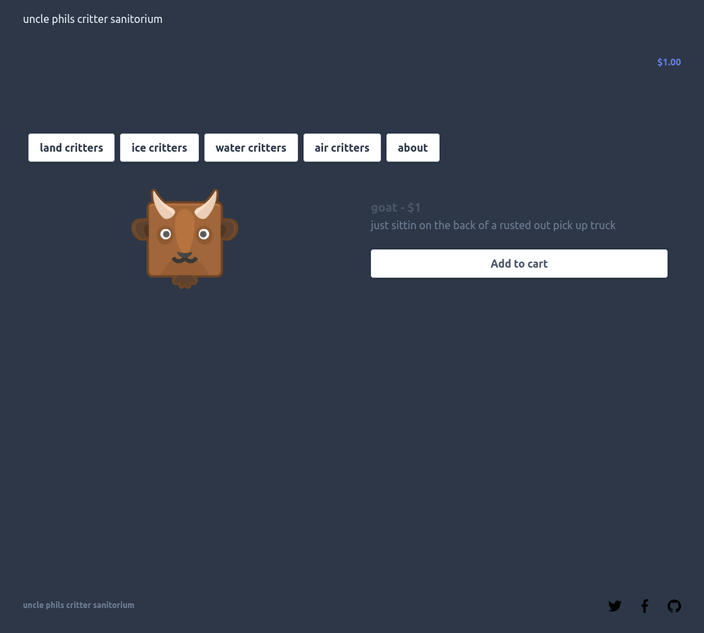
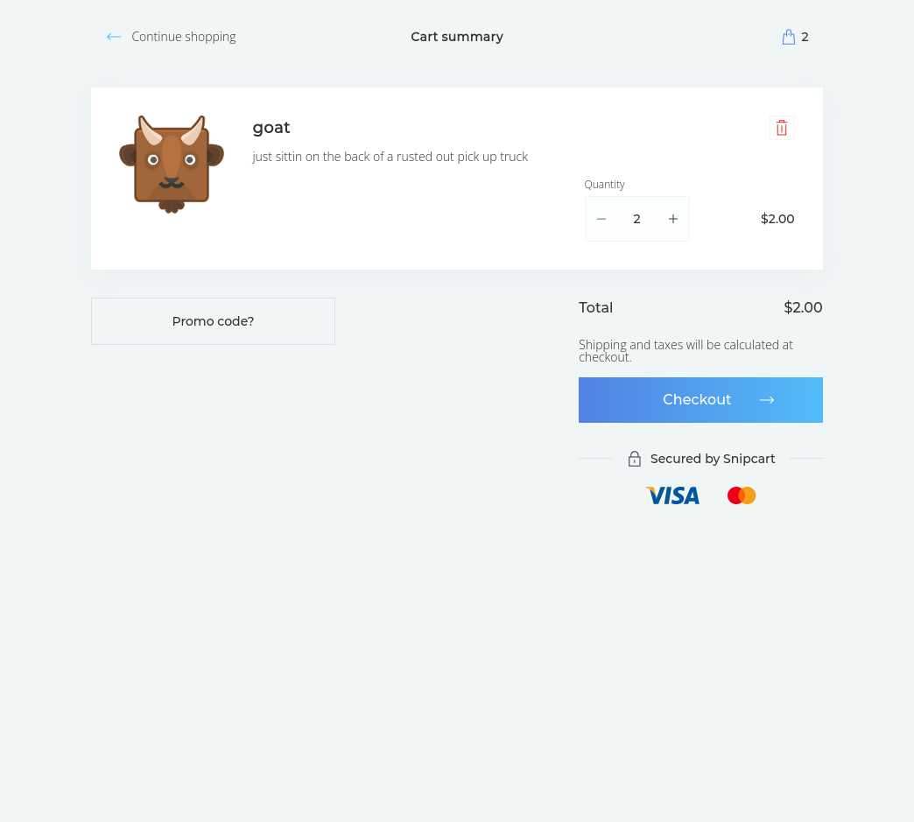
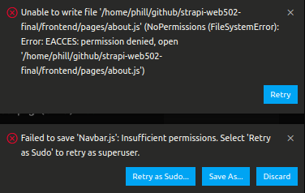

# WEB502 final submission

## Admin Pages

> The admin pages present a GUI for managing content on the website. 

### Users

> From this section of the admin pages we can modify new and current users, as well as modify their specific roles.



### Categories

> From this section of the admin pages we can modify new and current categories.



### Products

> From this section of the admin pages we can modify new and current products, as well as which categories the product would be placed within.




### Media

> From this section of the admin pages we can modify new and current media to be displayed via the UI.




## Front End UI

### Home Page



### Catoegory Page



### Product Page



### Checkout Page



### About and Contact Page

> I had planned to add an about page and a contact page, which is quite easy using Next.js. I would need to simply add the react code to an ```about.js``` file with react code to ```frontend/pages/``` directory and add a link to the ```Navbar.js``` file located in the ```frontend/components/``` directory. And then complete the same process for the contact page. For some reason, strapi refused to allow me citing user permission errors. I tried troubleshooting via google, strapi docs, and stack overflow but could not find a solution to implement. Every time I tried I receieved the errors shown below. Even when run as sudo, the changes would not save and the same errors would repeat.

